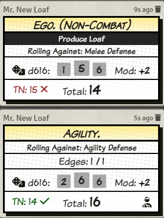
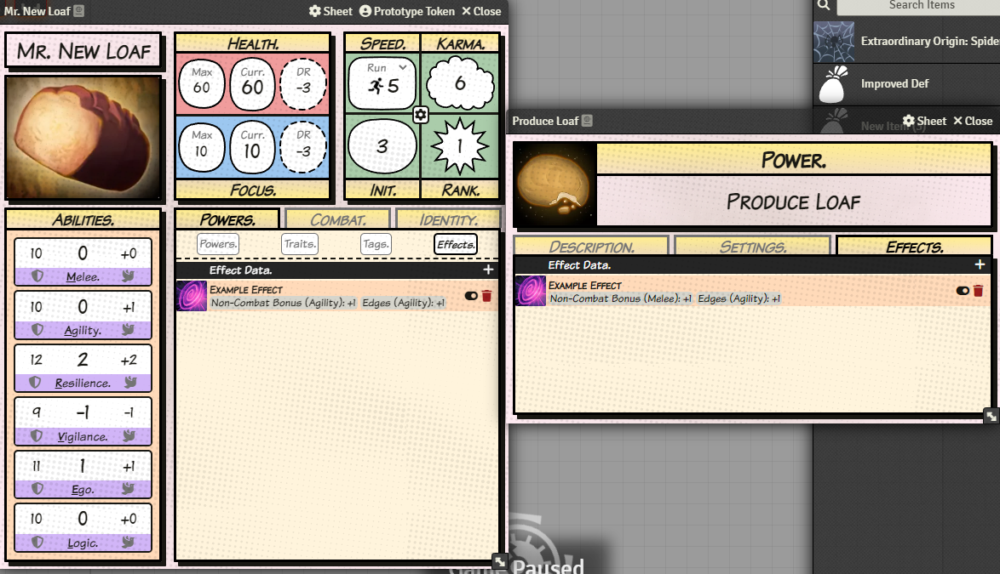

# Comic Book RPG

> **Disclaimer:** This unofficial system for [Foundry VTT](https://foundryvtt.com) is compatible with the [Marvel Multiverse RPG](https://www.marvel.com/rpg), however, you **_must_** buy the Core Rulebook from the previous link in order to use it. Note, this system is independently made, and fully unofficial, with no association with Marvel or associated companies. Also note, I do not provide any content, such as items, powers, traits, tags, pre-generated character sheets, etc.

## Installing the System

### Via Manifest Link (Recommended)

1. In Foundry, navigate to the "Game Systems" tab and click the "Install System" button.
2. Copy and paste the following link <https://github.com/jalensailin/mvrpg/releases/latest/download/system.json> into the "Manifest URL" field located at the bottom of the "Install System" window.

### Manually

1. Download the Multiverse RPG system from its [latest release](https://github.com/jalensailin/mvrpg/releases/latest/download/mvrpg.zip).
2. Unzip the downloaded file into the following data path in your Foundry VTT user-data folder: `data/systems`.

## Character Sheet

You can track all of a character's properties here. Many properties you can change by directly changing their value on the sheet. The text of these properties change to a red color when mousing over them. Other properties must be adjusted via Active Effect (see a few sections below). In the case of changing speeds, they have their own config window (see next section).

### Initiative/Speed Dialog

To adjust initiative edge and/or speeds, click the gear icon in the middle of the top-right panel of the character sheet.

### Team Maneuvers

You can track team maneuvers at the bottom of the Combat tab. You can press the `handshake` icon to activate/deactivate a team maneuver, however there is currently no mechanical effect (aka, focus isn't reduced and effects/abilities are not applied; it is currently just a visual indicator). There are plans to enhance the functionality in the future.

## Item Sheets

Define/adjust the properties of powers/traits/tags in the item sheet. Currently, only Power items have a Settings tab. If the item is a Power and has a roll associated with it, click the checkbox next to `Has Roll?`. Then, adjust the type of roll and whether or not it has a bonus/penalty, edges, and/or troubles.

## Rolling the D616

### Roll Dialog

To roll, click the name of one of the abilites, or click the "dice" icon on a power that has a roll associated with it. This will open up a dialog prompt, where you can customize the roll with edges/troubles. **Note**, this dialog can be skipped with ctrl-click (or if you want this behavior by default, you can adjust in the system settings).

### Chat Card

Once rolled, the result will be displayed in the chat with a custom chat card.

If the roll has edges and/or troubles, the total will be automatically calculated and displayed on the card. To reroll, click the die that you want to reroll. By default, the system automatically rolls all Troubles but this can be turned off in the settings if you prefer to do it manually. Note, the GM can also undo the last reroll(s) if a mistake was made.

See the reroll history by hovering over the icon in the top-left of the chat card.

### Damage

Calculate damage by clicking the "damage" icon in the bottom-right of the chat card. This will output a damage card to chat with the correct calculations.

## Active Effects

Active Effects are a built-in way to add modifiers to a character's properties. These can be created on a character sheet directly, or on an item (which will apply its effect to an actor that owns it).

To create an Active Effect, press the `+` icon in the header of the effect tab on either the item or actor sheet (see above). The following window will open automatically:

Then, press the button to add a 'change' to this effect. When you do, a blank 'change' will be added to the effect's config window. On the left side, you will see a drop-down menu which will help you select the property you want to modify, without needing to know its data path. The properties listed in the drop-down menu are the ones I have deemed generally safe to modify. If you wish to modify a property that isn't in the drop-down list, you may do so at your own risk by clicking the `keyboard` icon beside the drop-down menu, which will switch it to a text-input.

Note: In the `Effect Value` field, you can input a number or an actor property using the `@` symbol, like `@system.abilitires.melee.value`. You should even be able to combine them like `@system.abilities.melee.value + 10`.

## Future Work

- Add support for Foundry v12
- Improve Team Maneuver functionality.
- Add an item-type for Weapons/Generic Gear.
- Add an item-type for Occupations and Origins.
- See the [Issues Page](https://github.com/jalensailin/mvrpg/issues) for a more extensive list of planned features and known bugs.
